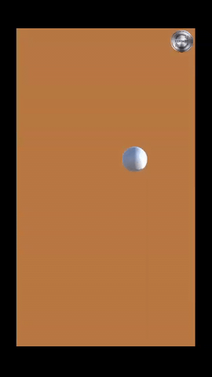

# Fruit-Ninja-Replica

## Description
this is a 2D game made by unity, it is a replica of Fruit Ninja.

## ScreenShot:

## Tools & languages:
* Unity (game Engine)
* C# (Script Code)
* Visual Studio Code (Text editor)

## Contribution:
Feel free to fork this project and add whatever you like. If you have any suggestions or any comments please feel free to contact me or to open an issue, use free license art assets please.

## Team:
[Jetlighters](https://github.com/JetLightStudio) having fun.
